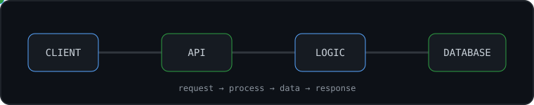

<!-- ====================================================== -->
<!--                     HERO SECTION                       -->
<!-- ====================================================== -->

  

  Software engineering student focused on backend development, 
  strengthening my skills through hands-on projects and continuously learning 
  how reliable software systems are designed, built, and maintained.

 

  

 

 

<h2 align="center">About Me</h2>

  I’m a software engineering student and self-learner who enjoys learning by building,
  experimenting, and solving real development problems.

  My main focus is <strong>backend development</strong>, while continuing to build
  a broader understanding of databases, cloud infrastructure, networking,
  testing, architecture, and full-stack development.

  I’m interested in more than making software work.
  I like understanding <strong>why it works</strong>, how its pieces communicate,
  where problems appear, and how good engineering decisions make systems
  easier to maintain and evolve.

  I’m still learning, constantly improving, and turning that learning into projects.

 

  

 

 

<h2 align="center">Tech Stack</h2>

  Technologies I've learned and worked with while building software.

 

<h3 align="center">Languages</h3>

  

 

<h3 align="center">Backend & Web</h3>

  

 

<h3 align="center">Databases</h3>

  

 

<h3 align="center">Cloud & DevOps</h3>

  

 

<h3 align="center">Developer Tools</h3>

  

 

<h3 align="center">Other Experience</h3>

  

  Machine Learning &nbsp;•&nbsp; NumPy &nbsp;•&nbsp; pandas &nbsp;•&nbsp; Game Development

 

 

<h2 align="center">Engineering Knowledge</h2>

  

 

I’m building a broad software engineering foundation around the way real systems are designed and operated, not just around individual frameworks. My strongest interest is backend development, where I’ve worked with REST APIs, authentication and JWT, validation, error handling, file uploads, WebSockets, database migrations, and API testing. I also enjoy working with data and databases, including PostgreSQL, MySQL, SQLite, MongoDB, schema design, relationships, SQL queries, indexes, transactions, and migrations. Beyond application code, I’m developing my understanding of Object-Oriented Programming, Functional Programming, Data Structures & Algorithms, Clean Code, debugging, testing, design patterns, software architecture, HTTP/HTTPS, TCP/IP fundamentals, DNS, client-server communication, cookies, headers, Linux, Docker, cloud platforms, deployment workflows, CI/CD, and the infrastructure that connects all of these pieces. My goal is to keep improving how I design, structure, debug, test, and reason about software while gradually understanding the full path from writing code locally to running reliable systems in real environments.

 

  

 

 

<h2 align="center">GitHub Activity</h2>

 

<table align="center">
<tr>
<td align="center" width="50%">

Development activity across my GitHub profile

</td>

<td align="center" width="50%">

Languages represented across my repositories

</td>
</tr>
</table>

 

  My development activity over time

 

 

<h2 align="center">Connect With Me</h2>

  I enjoy learning from other developers, discovering new ideas,
  and connecting with people who enjoy building software.

 

  

 

  

