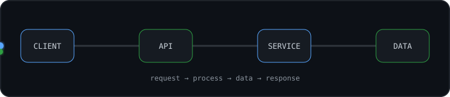

<!-- ====================================================== -->
<!--                        HERO                            -->
<!-- ====================================================== -->

  

  Software engineering student and self-learner who improves through hands-on projects, 
  problem solving, and understanding how software works beyond the surface.

  Building skills across backend systems, databases, cloud, networking, testing, and full-stack development.

 

  

## About Me

I learn best by building software, experimenting with ideas, debugging what breaks, and understanding why a system behaves the way it does. I’m especially interested in how the different parts of an application fit together — from the data model and API layer to the network, deployment environment, and user-facing experience.

My goal is not just to collect technologies, but to become better at **designing, structuring, testing, debugging, and reasoning about software**. I’m still learning, constantly improving, and turning that learning into real projects.

 

  

## Tech Stack

Technologies I have learned and worked with while building software.

### Languages

  
  &nbsp;&nbsp;
  
  &nbsp;&nbsp;
  
  &nbsp;&nbsp;
  
  &nbsp;&nbsp;
  
  &nbsp;&nbsp;
  
  &nbsp;&nbsp;
  
  &nbsp;&nbsp;
  

### Frontend

  
  &nbsp;&nbsp;
  
  &nbsp;&nbsp;
  
  &nbsp;&nbsp;
  
  &nbsp;&nbsp;
  

### Backend

  
  &nbsp;&nbsp;
  
  &nbsp;&nbsp;
  
  &nbsp;&nbsp;
  

### Databases

  
  &nbsp;&nbsp;
  
  &nbsp;&nbsp;
  
  &nbsp;&nbsp;
  

### Cloud & Infrastructure

  
  &nbsp;&nbsp;
  
  &nbsp;&nbsp;
  
  &nbsp;&nbsp;
  
  &nbsp;&nbsp;
  

### Developer Tools

  
  &nbsp;&nbsp;
  
  &nbsp;&nbsp;
  
  &nbsp;&nbsp;
  
  &nbsp;&nbsp;
  
  &nbsp;&nbsp;
  
  &nbsp;&nbsp;
  
  &nbsp;&nbsp;
  

### Other Experience

  
  &nbsp;&nbsp;
  
  &nbsp;&nbsp;
  
  &nbsp;&nbsp;
  

 

  

## Engineering Knowledge

  

I’m building a broad software engineering foundation that goes beyond individual frameworks. My experience includes API design, authentication, validation, error handling, file uploads, WebSockets, database design, SQL, migrations, indexing, transactions, testing, debugging, Object-Oriented Programming, Functional Programming, Data Structures & Algorithms, clean code, design patterns, and software architecture. I’ve also studied the fundamentals behind web systems — including HTTP/HTTPS, TCP/IP, DNS, ports, client-server communication, cookies, and headers — while gradually expanding into Linux, Docker, cloud platforms, deployment workflows, CI/CD, and object storage. The goal is to understand how the pieces connect and make better engineering decisions as the systems I build become larger and more realistic.

 

  

## GitHub

  
  

 

  

## Connect

I enjoy learning from other developers, discovering new ideas, and connecting with people who enjoy building software.

  

 

  

