  

  Software engineering student and self-learner who improves through hands-on projects,
  problem solving, and understanding how software works beyond the surface.

 

## Tech Stack

Technologies I have learned and worked with.

 

<table>
<tr>
<td width="150"><strong>Languages</strong></td>
<td>
  
  
  
  
  
  
  
  
</td>
</tr>

<tr>
<td><strong>Frontend</strong></td>
<td>
  
  
  
  
  
  
</td>
</tr>

<tr>
<td><strong>Backend</strong></td>
<td>
  
  
  
  
  
  
</td>
</tr>

<tr>
<td><strong>Databases</strong></td>
<td>
  
  
  
  
  
</td>
</tr>

<tr>
<td><strong>Cloud & Infra</strong></td>
<td>
  
  
  
  
  
  
</td>
</tr>

<tr>
<td><strong>Tools</strong></td>
<td>
  
  
  
  
  
  
  
  
</td>
</tr>

<tr>
<td><strong>Other Experience</strong></td>
<td>
  
  
  
  
  
  
</td>
</tr>
</table>

 

---

## GitHub

  
  

 

---

## Connect

I enjoy learning from other developers, discovering new ideas, and connecting with people who enjoy building software.

  

 

  

