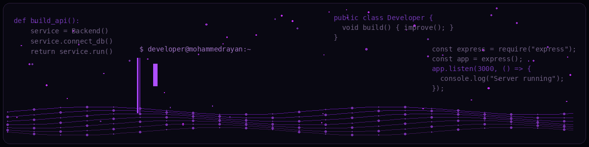

  

 

&gt; Building reliable software and continuously improving my development skills.  
## About Me  
- Software Developer focused on backend development  
- Interested in building reliable, maintainable, and scalable systems  
- Continuously improving my skills in databases, Linux, cloud, and software development

### Tech Stack

  
  
  
  
  
  
  
  
  
  
  
  
  
  
  
  
  
  
  
  
  
  
  
  
  
  
  

###  Connect With Me

  

---

